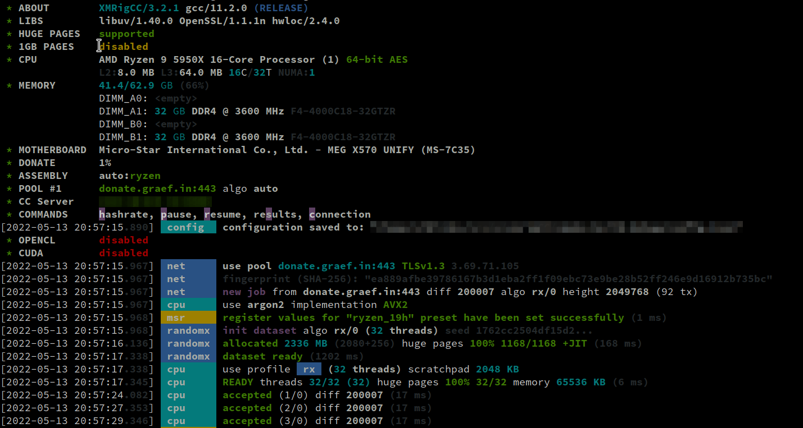
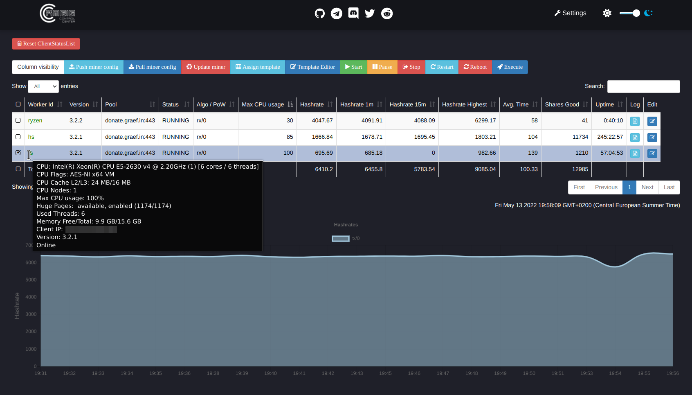

# XMRigCC 

XMRig is a high performance RandomX, CryptoNight and Argon2 CPU miner, with official support for Windows.

:bulb: **This is the CPU variant of XMRigCC, if you're looking for the AMD GPU (OpenCL) variant [click here](https://github.com/Bendr0id/xmrigCC-amd/).**

[](https://ci.appveyor.com/project/Bendr0id/xmrigcc)
[](https://hub.docker.com/r/bendr0id/xmrigcc/)
[](https://github.com/bendr0id/xmrigCC/releases)
[](https://github.com/bendr0id/xmrigCC/releases)
[](https://github.com/bendr0id/xmrigCC/releases)
[](https://github.com/bendr0id/xmrigCC/stargazers)


### About XMRigCC

XMRigCC is a fork of [XMRig](https://github.com/xmrig/xmrig) which adds the ability to remote control your XMRig instances via a Webfrontend and REST api.
This fork is based on XMRig and adds a "Command and Control" (C&amp;C) server, a daemon to restrat XMRigCCMiner and modifications to send the current status to the C&amp;C Server.
The modified version can also handle commands like "update config", "start/stop mining" or "restart/shutdown" which can be send from the C&amp;C-Server.
Remote Logging (The miner will upload its log to the C&amp;C Server).

Full Windows/Linux compatible, and you can mix Linux and Windows miner on one XMRigCCServer.

## Additional features of XMRigCC (on top of XMRig)

Check the [Coin Configuration](https://github.com/Bendr0id/xmrigCC/wiki/Coin-configurations) guide
* **Support of UPX2 variant (algo: "cn-extremelite/upx2")**
* **Support of CN-Conceal variant (algo: "cn/conceal")**
* **Better performance for ARMv8 CPUs**
* Full SSL/TLS support
* NUMA support
* Command and control server
* CC Dashboard with:
    * statistics of all connected miners
    * remote control miners (start/stop/restart/shutdown) 
    * remote configuration changes of miners
    * simple config editor for miner / config templates 
    * monitoring / offline notification push notifications via Pushover and Telegram 
* Daemon to restart the miner


**XMRigCC Miner**



**XMRigCC Server**


**XMRigCC Dashboard**



#### Table of contents
* [Download](#download)
* [Usage](#usage)
* [Wiki/Building/Howto](https://github.com/Bendr0id/xmrigCC/wiki/)
* [Common Issues](#common-issues)
* [Donations](#donations)
* [Contacts](#contact)

## Download
* Binary releases: https://github.com/Bendr0id/xmrigCC/releases
* Git tree: https://github.com/Bendr0id/xmrigCC.git
  * Clone with `git clone https://github.com/Bendr0id/xmrigCC.git` :hammer: [Build instructions](https://github.com/xmrig/xmrig/wiki/Build.

## Usage
### Basic example XMRigCCServer
```
xmrigCCServer --cc-port=3344 --cc-user=admin --cc-pass=pass --cc-access-token=SECRET_TOKEN_TO_ACCESS_CC_SERVER
```

### Options XMRigCCServer
```
TODO
```


### Basic example xmrigDaemon
```
xmrigDaemon -o pool.minemonero.pro:5555 -u YOUR_WALLET -p x -k --cc-url=IP_OF_CC_SERVER:PORT --cc-access-token=SECRET_TOKEN_TO_ACCESS_CC_SERVER --cc-worker-id=OPTIONAL_WORKER_NAME
```

### Options xmrigDaemon
```
TODO
```


## Common Issues
### XMRigMiner
* XMRigMiner is just the worker, it is not designed to work standalone. Please start **XMRigDaemon** instead.

### Windows only: DLL error on starting
* Make sure that you installed latest Visual C++ Redistributable for Visual Studio 2015. Can be downloaded here: [microsoft.com](https://www.microsoft.com/de-de/download/details.aspx?id=48145)

### Linux only: Background mode
* The `--background` option will only work properly for the XMRigServer. But there is a simple workaround for the XMRigDaemon process. Just append an `&` to the command and it will run smoothly in the background.

    `./xmrigDaemon --config=my_config_cc.json &` or you just use `screen`


### HUGE PAGES unavailable (Windows)
* Run XMRigDaemon as Administrator.
* On Windows it automatically enables SeLockMemoryPrivilege for current user, but reboot or sign out still required. [Manual instruction](https://msdn.microsoft.com/en-gb/library/ms190730.aspx).

### HUGE PAGES unavailable (Linux)
* Before starting XMRigDaemon set huge pages

    `sudo sysctl -w vm.nr_hugepages=128`

 
## Donations
* Default donation 5% (5 minutes in 100 minutes) can be reduced to 1% via command line option `--donate-level`. 

##### BenDroid (XMRigCC):
XMR:  `4BEn3sSa2SsHBcwa9dNdKnGvvbyHPABr2JzoY7omn7DA2hPv84pVFvwDrcwMCWgz3dQVcrkw3gE9aTC9Mi5HxzkfF9ev1eH`

AEON: `Wmtm4S2cQ8uEBBAVjvbiaVAPv2d6gA1mAUmBmjna4VF7VixLxLRUYag5cvsym3WnuzdJ9zvhQ3Xwa8gWxPDPRfcQ3AUkYra3W`

BTC:  `3Gwq9tveCZtLAiXX7mxhjbrh38GPx1iXdB`

##### xmrig:
XMR:  `48edfHu7V9Z84YzzMa6fUueoELZ9ZRXq9VetWzYGzKt52XU5xvqgzYnDK9URnRoJMk1j8nLwEVsaSWJ4fhdUyZijBGUicoD`

BTC:  `1P7ujsXeX7GxQwHNnJsRMgAdNkFZmNVqJT`

## Contact
* ben [at] graef.in
* Telegram: @BenDr0id
* [discord](https://discord.gg/r3rCKTB)
* [reddit](https://www.reddit.com/user/BenDr0id/)
